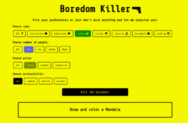

# boredom-killer
Boredom Killer - web app built with React, searching for boredom-killing-activities.

Fully responsive web application uses Bored API to find an activity, according to selected by user or totally random parameters.

### Used technologies :
- React 
- Sass
- Axios 

Project bootstrapped with [Create React App](https://github.com/facebook/create-react-app).
Font icons provided by [Font Awesome](https://fontawesome.com/).

